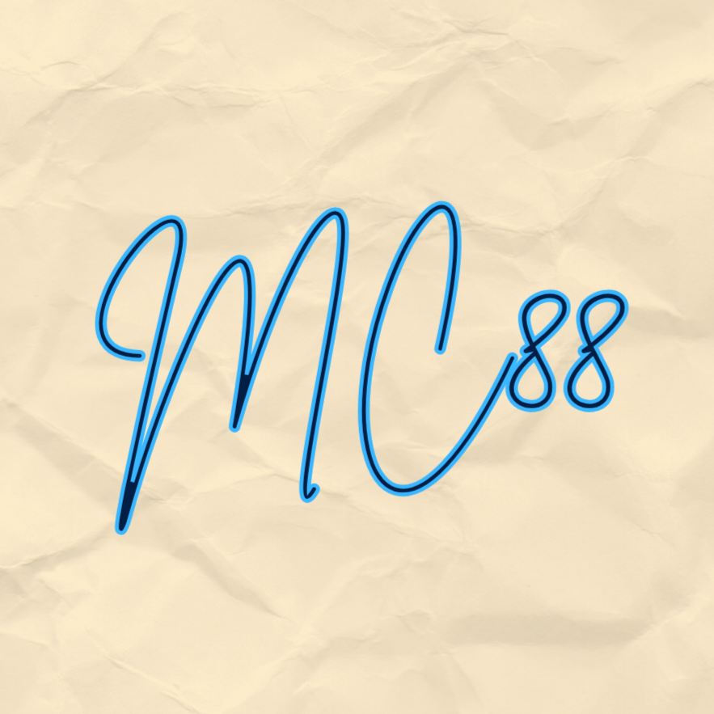

# RMC88 Remote

RMC88 Remote is a lightweight, high-performance, and 99% offline-ready web application that turns your smartphone into a wireless touchpad, keyboard, and system controller for your Windows PC.

---

## 🚀 Step-by-Step Installation Guide (For Beginners)

If you have never installed Python or any development tools before, don't worry! Just follow these simple steps:

### Step 1: Install Python
1. Go to the official Python website: [python.org/downloads](https://www.python.org/downloads/)
2. Download the latest version of Python for Windows (e.g., Python 3.x).
3. **CRITICAL:** During the installation, make sure to check the box at the bottom that says **"Add Python to PATH"** before clicking "Install Now".
4. Once finished, you can verify it by opening Command Prompt (`cmd`) and typing `python --version`.

### Step 2: Download the Project Files
Make sure you have the following two files in the **same folder** on your computer:
1. `index.html` (The mobile web interface)
2. `server.py` (The Python backend server)

### Step 3: Install Required Libraries
Open your Command Prompt (`cmd`) or PowerShell, navigate to the folder where your files are saved, and run the following command to install the required libraries:

```bash
pip install flask flask-cors pyautogui qrcode.
---
Step 4: Run the Server
Double-click server.py, or run it from your terminal:
python server.py
A black window will appear showing a local network link (e.g., http://192.168.x.x:5555) and a QR code.
Step 5: Connect Your Phone
​Turn on the Mobile Hotspot on your PC, or connect both your PC and your phone to the same Wi-Fi network.
​Scan the QR code displayed in your terminal using your phone's camera, or type the URL directly into your phone's browser.
​Enjoy your 99% offline, ultra-smooth remote control!
​🛠️ Requirements & Dependencies
​Python 3.x
​Libraries:
​Flask (Web server framework)
​Flask-CORS (Cross-origin resource sharing)
​PyAutoGUI (Mouse and keyboard automation)
​qrcode (Terminal QR code generation)
​📄 Copyright & Support
​Copyright: © 2026
​Developer: Mohamed005cheikh@gmail.com | by MC88
​WhatsApp: 30726475

<div align="center">
  <br>
  
  <br>
</div>
